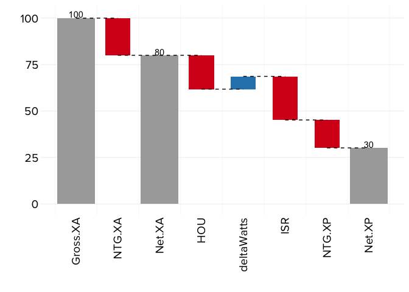

<!-- README.md is generated from README.Rmd. Please edit that file -->
Motivation
----------

This package is intended to provide a simple visualization of performance for energy efficiency programs, as argued by Kasman et al. (2015). In energy efficiency, expected program impacts are reported (*ex ante*) and then later evaluated (*ex post*). The evaluated savings, when different from the reported values, are generally accompanied with reasons or factors/parameters explaining the source of changes. However, the order in which the factors are presented can influence how important each factor appears. Permuting the factors to order independent values removes the bias of order.
For an explicit example (taken from Kasman et al. (2015)), consider a lighting program with the following key values provided:

``` r
Gross.XA <- 100 # reported Gross Savings (arbitrary units)
NTG.XA <- 0.8 # 90% NTG reported
Net.XA <- Gross.XA*NTG.XA
Net.XA #80
#> [1] 80
NTG.XP <- 0.6 # 80% NTG found in evaluation
Gross.XP <- 50 # Gross Savings found in evaluation (arbitrary units)
Net.XP <- Gross.XP*NTG.XP
Net.XP #30
#> [1] 30
```

The source of difference between the reported savings of 80 to the evaluated result of 30 is going to be critical for program improvements.

Let's assume that the evaluator advises that the following impact parameters are driving the estimate of evaluated gross (*ex post* or `Gross.XP`) values. Note that all of these are provided as a realization rate (the ratio of the evaluated parameter to the reported parameter).

``` r
# define impact parameters
HOU <- 0.7 # Hours of lighting use (HOU_expost/HOU_exante) smaller as evaluated
deltaWatts <- 1.14 # difference in lighting watts higher as evaluated
ISR <- 0.63 # Installation Rate (IRR_expost/IRR_exante) smaller as evaluated
```

With these impact parameters, program administrators may want to focus on Installation Rate. However, when provided, as usual, in a table, it is difficult to distill importance from these parameters.

Simple Visualization of Non-Permuted Values
-------------------------------------------

We can create a waterfall plot that presents these values in this order.

``` r
# ensure that we have a dataframe ready to put into waterfallPrep()
myparamdf <- data.frame( # lighting example
                          params = c("HOU","deltaWatts","ISR"),
                          value = c(0.7, 1.14, 0.63),
                          stringsAsFactors = FALSE
                         )
library(evalwaterfallr)
lighting_given <- waterfallPrep(myparamdf, 
                                gross.report=100, NTG.report=0.8, NTG.eval=0.6,
                          altparamnames = NULL,
                                output="none") # none means no permutation
lighting_given
#>     variable  given    total    base increase decrease
#> 1   Gross.XA 100.00 100.0000      NA       NA       NA
#> 2        HOU   0.70       NA 70.0000      0.0  30.0000
#> 3 deltaWatts   1.14       NA 70.0000      9.8   0.0000
#> 4        ISR   0.63       NA 50.2740      0.0  29.5260
#> 5   Gross.XP     NA  50.2740      NA       NA       NA
#> 6     NTG.XP   0.60       NA 30.1644      0.0  20.1096
#> 7     Net.XP     NA  30.1644      NA       NA       NA
```

``` r
library(evalwaterfallr)
waterfallPlot(lighting_given)
```


This plot does not provide any information to those most interested in the net impacts. For those, we must look at the factors in an order independent way, so that we can see their impact on the net value and the gross value, in context.

Permuted Values
---------------

This package greatly simplifies creating permuted values (compared to doing the matrix calculations in a spreadsheet application, such as MS Excel). The function `waterfallPrep()` calculates the tables for no permutation (as shown above), gross permutation, and net permutation all at the same time, unless output is otherwise defined.

``` r
library(evalwaterfallr)
lighting_all <- waterfallPrep(myparamdf, 
                          gross.report=100, NTG.report=0.8, NTG.eval=0.6,
                          altparamnames = NULL,
                                output="all")
#> Warning: doParallel may make this function faster for large order
#> permutations if it is installed.
lighting_gross <- lighting_all[[2]]
lighting_net <- lighting_all[[3]]
```

``` r
library(evalwaterfallr)
waterfallPlot(lighting_gross) # gross permutation plot
```


``` r
waterfallPlot(lighting_net) # net permutation plot
```



References
----------

Kasman, Robert, Adam Scheer, Rachel Sackman, Rafael Friedmann, and Janice Berman. 2015. “Development of Order-Independent Waterfall Graphics to Enable Comprehensive Understanding of Impact Evaluation Results.” *Proceedings of the 2015 International Energy Program Evaluation Conference*.
