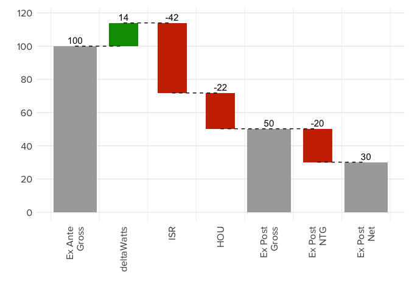
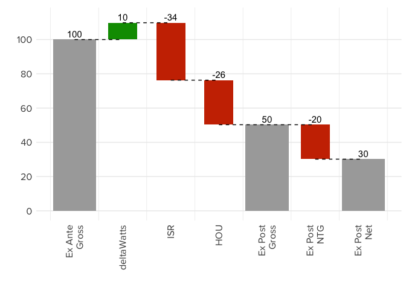

<!-- README.md is generated from README.Rmd. Please edit that file -->
    ## 
    ## Attaching package: 'dplyr'

    ## The following objects are masked from 'package:stats':
    ## 
    ##     filter, lag

    ## The following objects are masked from 'package:base':
    ## 
    ##     intersect, setdiff, setequal, union

Motivation
----------

This package provides a simple visualization tool for the display of energy efficiency program evaluation results as argued by Kasman et al. (2015). Differences between claimed (*ex ante*) and evaluated (*ex post*) savings are most informative and actionable if the reasons behind discrepancies are quantified and reported. A best practice for reporting variations in ex ante and ex post savings is the use of dimensionless multiplicative impact parameters, such as an Hours of Use (HOU) factor that gives the ratio of ex post HOU to ex ante HOU. When impact parameters are reported in this manner, a powerful visualization of quantified discrepancies is made possible. However, the magnitude of a savings discrepancy associated with a given impact parameter is dependent upon the other impact parameters. The interdependence of impact parameter savings adjustments also creates an issue of order-dependence when constructing a graphical representation of ex ante/ex post adjustment. The permutation procedure in Kasman et al. (2015) ensures that graphics are order-independent and normalized.

From that paper, consider a lighting program with the following key values provided:

``` r
Gross.XA <- 100 # reported Gross Savings (arbitrary units)
NTG.XA <- 0.8 # 90% NTG reported
Net.XA <- Gross.XA*NTG.XA
Net.XA #80
#> [1] 80
NTG.XP <- 0.6 # 80% NTG found in evaluation
Gross.XP <- 50 # Gross Savings found in evaluation (arbitrary units)
Net.XP <- Gross.XP*NTG.XP
Net.XP #30
#> [1] 30
```

The following impact parameters are reported:

``` r
# define impact parameters
HOU <- 0.7 # Hours of lighting use (HOU_expost/HOU_exante) smaller as evaluated
deltaWatts <- 1.14 # difference in lighting watts higher as evaluated
ISR <- 0.63 # Installation Rate (IRR_expost/IRR_exante) smaller as evaluated
```

Here we develop waterfall graphics to quantify the ex ante/ex post savings adjustments as well as net to gross (NTG) adjustments.

Simple Visualization of Non-Permuted Values
-------------------------------------------

First, we create a waterfall plot that presents an order-dependent application of impact parameters.

``` r
# ensure that we have a dataframe ready to put into waterfallPrep()
myparamdf <- data.frame( # lighting example
                          params = c("HOU","deltaWatts","ISR"),
                          value = c(0.7, 1.14, 0.63),
                          stringsAsFactors = FALSE
                         )
lighting_given <- waterfallPrep(myparamdf, 
                                gross.report=100, NTG.report=0.8, NTG.eval=0.6,
                          altparamnames = NULL,
                                output="none") # none means no permutation
lighting_given
#>        variable  given    total    base increase decrease
#> 1 Ex Ante Gross 100.00 100.0000      NA       NA       NA
#> 2           HOU   0.70       NA 70.0000      0.0  30.0000
#> 3    deltaWatts   1.14       NA 70.0000      9.8   0.0000
#> 4           ISR   0.63       NA 50.2740      0.0  29.5260
#> 5 Ex Post Gross     NA  50.2740      NA       NA       NA
#> 6   Ex Post NTG   0.60       NA 30.1644      0.0  20.1096
#> 7   Ex Post Net     NA  30.1644      NA       NA       NA
```

``` r
waterfallPlot(lighting_given)
```


Upon changing the order of the impact parameters, the associated step sizes also change.

``` r
# change the dataframe  to put into waterfallPrep()
myparamdf <- data.frame( # lighting example WITH CHANGED ORDER
                          params = c("deltaWatts","ISR","HOU"),
                          value = c(1.14, 0.63, 0.7),
                          stringsAsFactors = FALSE
                         )
lighting_given <- waterfallPrep(myparamdf, 
                                gross.report=100, NTG.report=0.8, NTG.eval=0.6,
                          altparamnames = NULL,
                                output="none") # none means no permutation
lighting_given
#>        variable  given    total     base increase decrease
#> 1 Ex Ante Gross 100.00 100.0000       NA       NA       NA
#> 2    deltaWatts   1.14       NA 100.0000       14   0.0000
#> 3           ISR   0.63       NA  71.8200        0  42.1800
#> 4           HOU   0.70       NA  50.2740        0  21.5460
#> 5 Ex Post Gross     NA  50.2740       NA       NA       NA
#> 6   Ex Post NTG   0.60       NA  30.1644        0  20.1096
#> 7   Ex Post Net     NA  30.1644       NA       NA       NA
```

``` r
waterfallPlot(lighting_given)
```



Permuted Values
---------------

For an accurate representation of step size that solves the order-dependence issue, a complicated mathematical procedure is required in which the average of all possible permutations is taken for each impact parameter. This package greatly simplifies creating permuted values (compared to doing the matrix calculations in a spreadsheet application, such as MS Excel). The function `waterfallPrep()` calculates the tables for no permutation (as shown above), gross permutation, and net permutation all as detailed in Kasman et al. (2015)

``` r
lighting_all <- waterfallPrep(myparamdf, 
                          gross.report=100, NTG.report=0.8, NTG.eval=0.6,
                          altparamnames = NULL,
                                output="all")
#> Warning: doParallel may make this function faster for large order
#> permutations if it is installed.

#> Warning: doParallel may make this function faster for large order
#> permutations if it is installed.
lighting_gross <- lighting_all[[2]]
lighting_net <- lighting_all[[3]]
```

``` r
waterfallPlot(lighting_gross) # gross permutation plot
```



``` r
waterfallPlot(lighting_net) # net permutation plot
```


These graphics are now order-independent and show accurate savings step sizes in both the gross and net domains.

References
----------

Kasman, Robert, Adam Scheer, Rachel Sackman, Rafael Friedmann, and Janice Berman. 2015. “Development of Order-Independent Waterfall Graphics to Enable Comprehensive Understanding of Impact Evaluation Results.” *Proceedings of the 2015 International Energy Program Evaluation Conference*.
